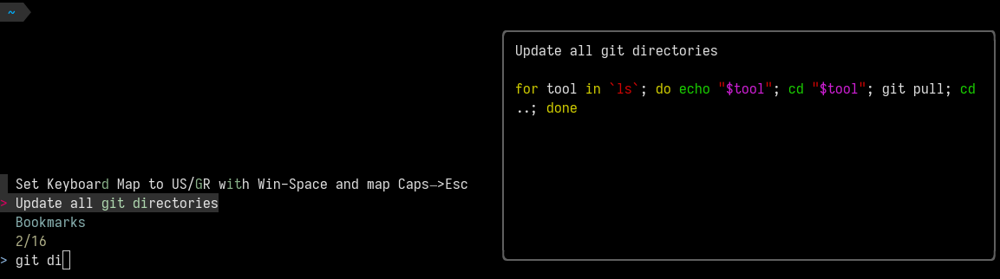

# FZF Command Bookmarks

This is a kind replacement of the deceased [marker](https://github.com/pindexis/marker).
It uses `fzf` and `highlight` - its only requirements.

It lets you add a command in the bookmarks and then search through your bookmarks.



There are two shortcuts:

  - Add a bookmark (`Ctrl-K` deault, managed by `FZF_COMMAND_BOOKMARKS_ADD`)
  - Show & search bookmarks (`Ctrl-K` deault, managed by `FZF_COMMAND_BOOKMARKS_SHOW`)

The bookmarks are saved in a file (`~/.fzf-command-bookmarks` default,
managed by `FZF_COMMAND_BOOKMARKS_FILE`) in the following notation:

```
command##Title
```

There is currently both bash and zsh support but more tests should be conducted
(old versions, weird setups, etc.). I don't use fish, so feel free to open an MR.
